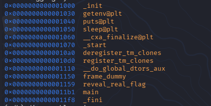
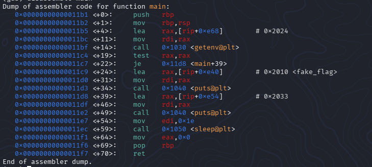
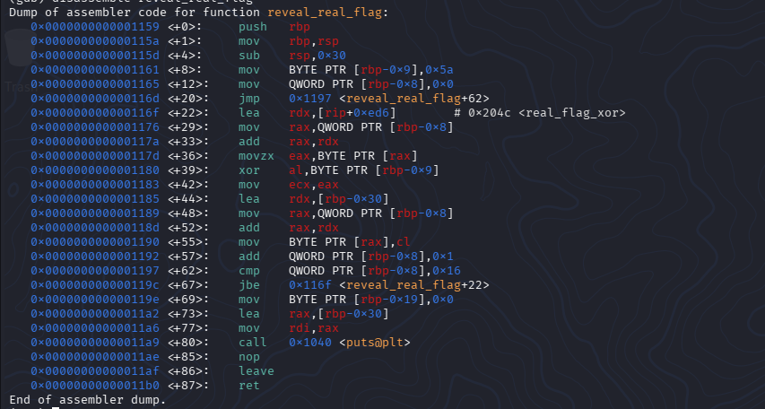
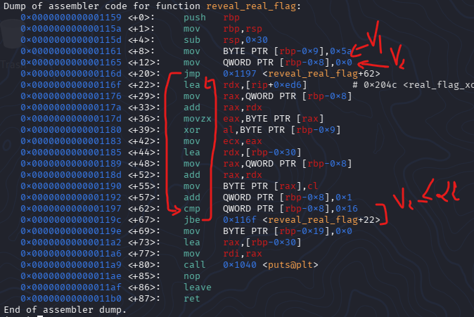
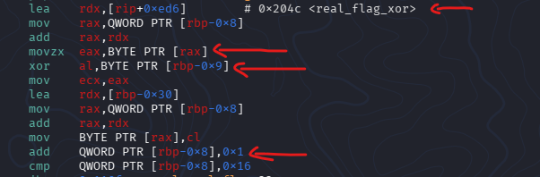
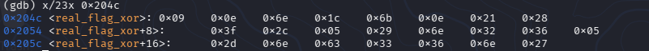
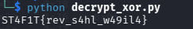

# CTF Write-Up: [RE-INTRO]

**Event:** ST4F1T
**Category:** Reverse Engineering
**Difficulty:** Easy
**Author:** Ryn

## Challenge Description

This was an easy ELF RE challenge ( Intro )

> Note: I've been learning RE recently, so this reflects a beginner's approach. There are likely faster methods.


## Initial Recon

To start off lets check what kind of binary we're dealing with

```bash
file intro
```

```bash
# output
intro: ELF 64-bit LSB pie executable, x86-64, version 1 (SYSV), dynamically linked, interpreter /lib64/ld-linux-x86-64.so.2, BuildID[sha1]=fb40fd311a6055a9a2625469471c58b3b3ce7378, for GNU/Linux 3.2.0, not stripped
```

**Observations:**
- File type: `ELF`
- Architecture: `x64`
- Stripped: `No`


## Static Analysis

### Strings

```bash
strings challenge_binary | grep -i ST4F1T{.*}
```

```
# output
ST4F1T{h4nt4_zl9ti}
```

Sure enough, here's the fake flag. When using the strings without grep with can see that there is string "SHOW_FAKE_FLAG", intially i thougth this was a env variable which would hint that the binary checks for env var then shows a flag based on that ( spoiler : this was a bait )

### Disassembly 

Tool used: `gdb`

first thing i did is checking for function names and any symbols

```bash
info functions
```

output :


Important here : `reveal_real_flag`, `main`

next step is disassembling main

```bash
disassemble main
```

output : 


We can see that the program actually calls `getenv()` but no `reveal_real_flag()` call, thats weird, you see that the main function can't show the real flag its just a decoy as stated before. 

so : 
```bash
disassemble reveal_real_flag
```

output:


If you understand a bit of assembly you can see that after reserving 48 bytes of memory for the local variables, then sets one of them to `0x5a` (90) and another to `0x0` (0), lets call them V1 and V2, then we jump to line `+62` and compare the V2 to `0x16` (22) and then jump if below to line `+22`.



This looks like a for loop so lets inspect the body, inspecting the body we can see that on line `+22` we compute the address containing `real_flag_xor`, from here you already know its xor encrypted and the key is probably V1 `0x5a`, the following instructions basically loop through the bytes of the xor encrypted flag and decrypt them one by one !

PS : since gdb shows `real_flag_xor` address in static mode we can conclude that its probably in .data or .rodata sections of the binary. 



## Solution

Tool used: `gdb`

Well now we know what the program actually does on our own, fortunately gdb shows us the static address of `real_flag_xor`, knowing we have to loop from 0 to 22 ( 23 iterations ) so we also know the flag is `23 bytes` long.

So :

```bash
x/23x 0x204c # copied address from gdb
```



Retrieved bytes : `0x09 0x0e 0x6e 0x1c 0x6b 0x0e 0x21 0x28 0x3f 0x2c 0x05 0x29 0x6e 0x32 0x36 0x05
0x2d 0x6e 0x63 0x33 0x36 0x6e 0x27`

now you can either go the lazy way (AI), or take the satisfying route and write a quick Python script to decrypt it yourself.

```python
encrypted_bytes = [0x09,0x0e,0x6e,0x1c,0x6b,0x0e,0x21,0x28,
        0x3f,0x2c,0x05,0x29,0x6e,0x32,0x36,0x05,
        0x2d,0x6e,0x63,0x33,0x36,0x6e,0x27]

key = 0x5a 

decrypted = ''.join(chr(b ^ key) for b in encrypted_bytes)

print(decrypted)
```

And here is the flag  




## Flag

```
ST4F1T{rev_s4hl_w49il4}
```

## Extra

- This is obviously overkill you can just plug the ETF on dogbolt and understand it faster and copy paste the decompiled C code of `reveal_real_flag` into ChatGPT but where is the fun in that. 


*Write-up by Ryn — ST4F1T CTF [2026]*