# CTF Write-Up: [RE-rwina]

**Event:** ST4F1T
**Category:** Reverse Engineering
**Difficulty:** "9wis7"
**Author:** Ryn

## Challenge Description

This was an hard'ish ELF RE challenge ( rwina ), starting with a .pdf file

> Note: Again this reflects a beginner's approach. This challenge isn't as straightforward as the intro one, i didn't even complete it the day of the CTF couldn't focus.


## Initial Recon

To start off we see that we have a pdf file, opening it will show the following

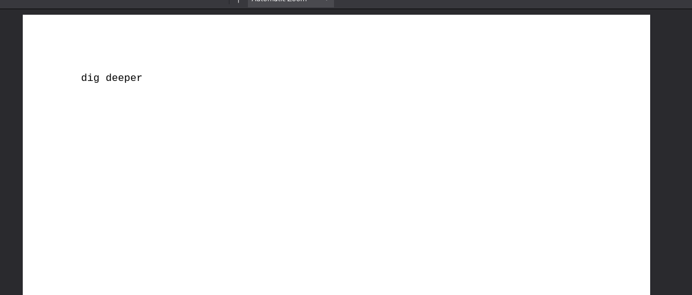

Can't be this easy ... 
My next step was to use binwalker to check if the file is hiding anything.

```bash
binwalk challenge.pdf
```

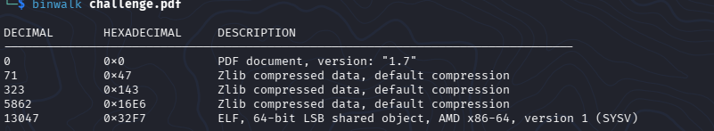

```bash
dd if=challenge.pdf of=binary.elf bs=1 skip=13047
```

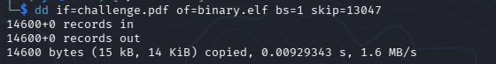

Lets check what kind of binary we're dealing with

```bash
file binary.elf
```

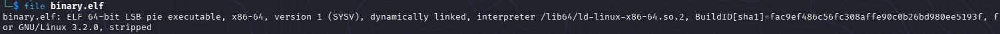


**Observations:**
- File type: `ELF`
- Architecture: `x64`
- Stripped: `No`

Lets add the execution permissions to see what happens when we run it

```bash
chmod +x binary.elf
```
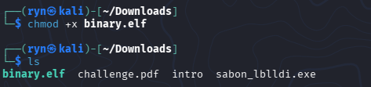

DISCLAIMER : based on the challenge description, its supposed to be a malware so i wouldn't recommend running it before getting a snapshot and disconnecting your machine from the network, but since this is done in a CTF environment we'll assume its safe...


This is stuck here now, lets not waste anymore time and try to debug this

## Static Analysis

### Disassembly 

Tool used: `radare2`

This one was a bit "complicated" and designed to confuse, so i jumped directly on radare2 ( the truth is i tried finding stuff on gdb and ghidra but i ended up just finding a few hints but nothing concrete )

```bash
r2 binary.elf
```

To start off we can analyze the binary using the `aaa` command and then list all symbols using `is`.

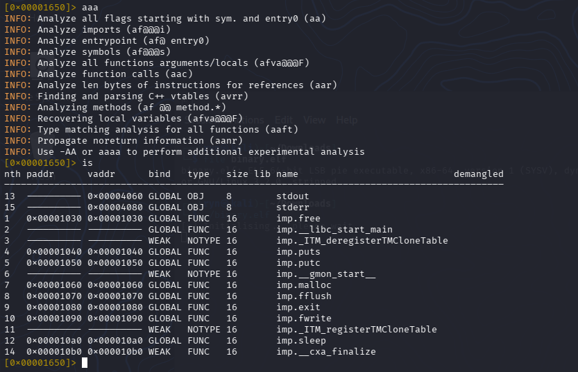

from the symbols we notice that there is no _start or _main function to seek, so my first reflex was to check header and see if i could figure out the entry point ( failed ), so i immediately went for `s entry0` 

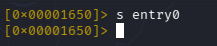

(It didn't change the address simply because we're in static analysis, lets just act like we found the entrypoint...)

Now we run `pdf`

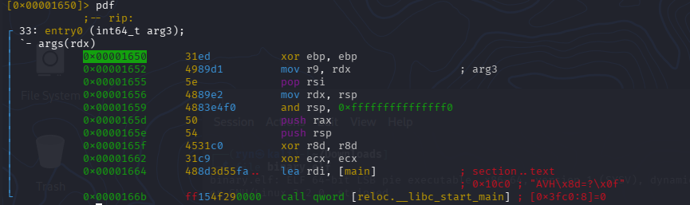

As you can see at the entry point the program is computing the address of "main" into the `rdi` register, in ELF ASM we know that `rdi` register is the first argument based on the calling convention (radare2 is making our lives less miserable and giving us the address its pointing to)

A thing to keep in mind, is we didn't have "main" displayed we'd still assume its pointing to the entry point of the program because loaders call `_start` which calls `__libc_start_main` with the `main` address as the first argument.

Anyways lets run
```bash
s 0x10c0 # copied from radare2 
```
This fails ... because we're still not debugging this is static lets switch to debug mode

```bash
ood
```

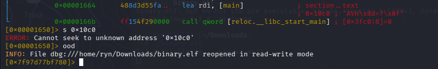

## Dynamic Analysis

### Debugging

Now lets rerun

```bash
s entry0
pdf
```

Get the actual dynamic address of whats supposed to be the `main` function

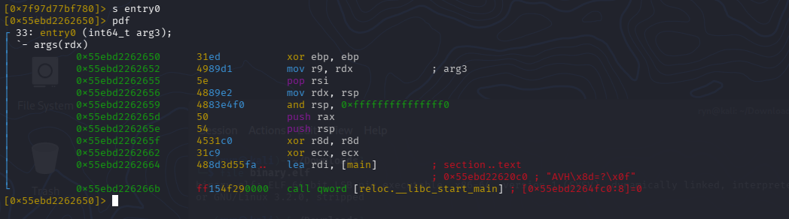

Now we seek.

```bash
s 0x55ebd22620c0 # copied from radare2
pdf
```

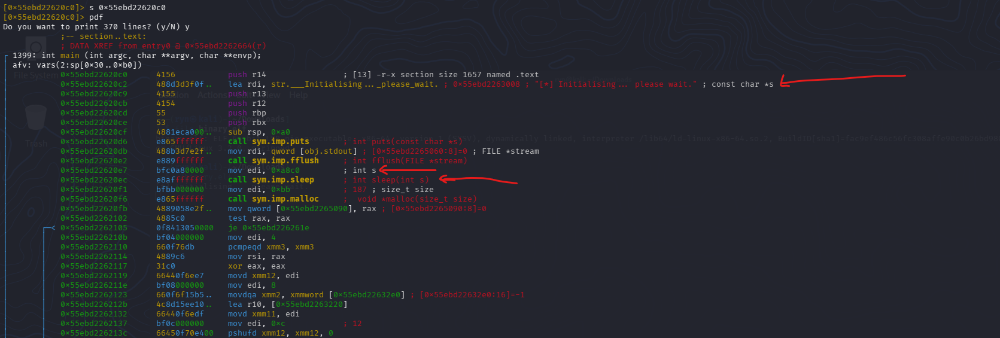

Oh, there is 370 lines, this is gonna be a mess (rwina) lets use the visual mode

```bash
VV
```

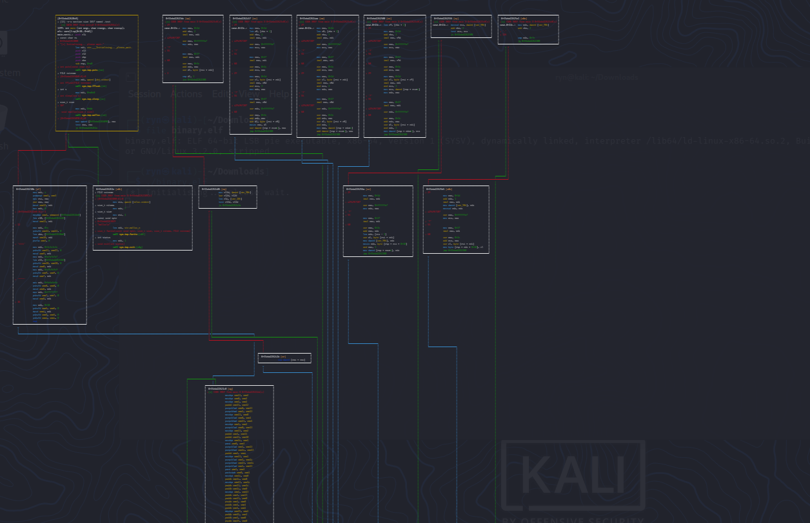
*This is slightly zoomed out there is more mess below this*

I went through most of it manually, i have no idea if there is a faster/more convenient way to find what i found ... but before that, since we know the sleep is there to annoy us in our debugging process lets drop a breaking point at the sleep call and change the `rdi` register before it calls to make it sleep for 0 seconds ( you can also just set the `rip` to be the following instruction )

Lets run 

```bash
pd 20
db 0x55ebd22620c0 # start of main function setup 
db 0x55ebd22620ec # sleep function call
```
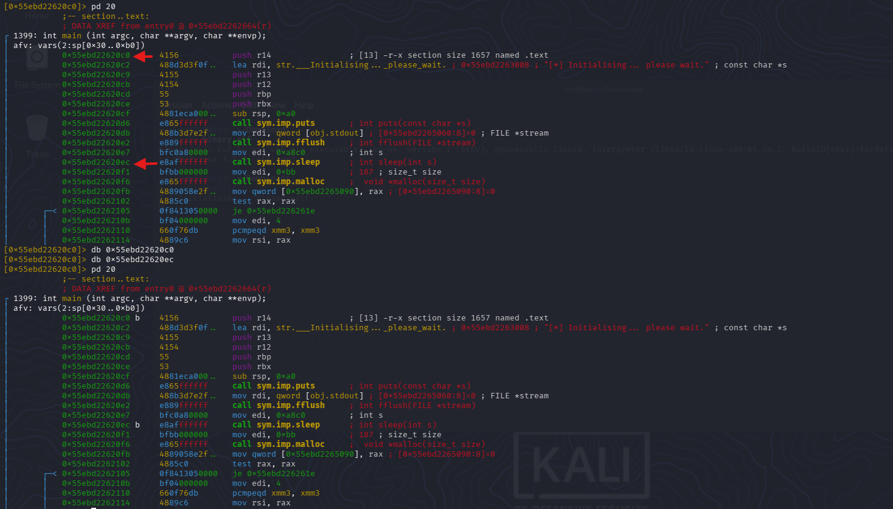

and lets just `continue` using

```bash
dc
```

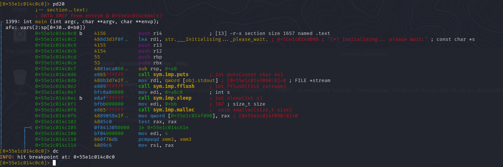

Lets run it again 

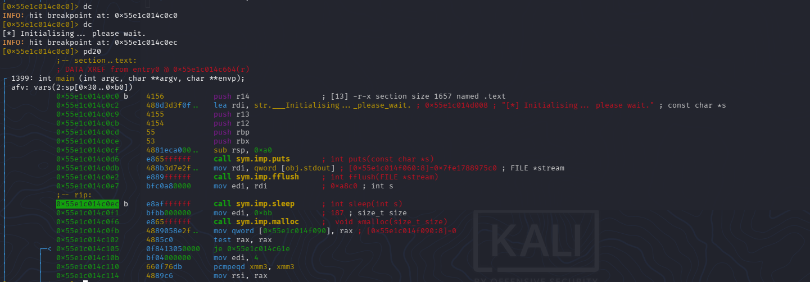

Nice now we're just before the call of sleep lets set the value of `rdi` to `0x0` and basically make it 0s sleep

```bash
dr rdx = 0x0
```

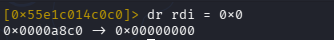

and lets 

```bash
dc
```

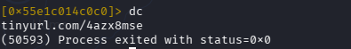

The program shows a URL ...
Apparently we managed to land in a branch of the binary that shows us this URL ( im too tired to investigate why and explain it, i'll maybe do it later and update this part)

## Solution

Tool used: `python`

Opening the link we land on a mediafire page.


Downloading it ( still assuming this is safe ) we get a `.ps1` which is the extension of powershell code

lets see the contant

```bash
cat chall.ps1
```

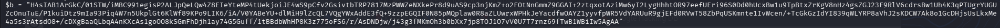

This looks like b64 encoding lets decode and decompress the gzip we get
You probably guessed we're going for the funnier option to decode this

```python
import base64, gzip

b64 = "H4sIAB1ArGkC/01STW/iMBC991egisP2ALJpQeLQw4Z8EIeYteMP4tUekjoiJE4wS9pCfv2GsivtbTRP7817MzPWWZeNXkePr8d9uAS9cp3njKmZ+o2FOtNnGmmZ9GGAI+2ztqxotAziMw6yI2LygHhhtOR97eefUEri96S0Dd0hUcxBw1u9TpBtxZrKgV8nHz4gsZGJ23F9RlV6cdrsBw1Uh4K3qPTUgrYUGUZcOnuTuE/P1kuiDtz9mIa93Piq4W7n5UkplGt6KlWf89KPo9LIK6/iA/V0YABeYU+dlMiH9lZcQL7VQgYWxAddE3fQ+9zzpEGQIF0N85pMQplaw0R8aZLUwrxWPHkJeYacdfwOAYZ1yyvfpWR5VdYARUuR9gjEFd0RVwT58ZbPqUSKmnte1IvWcen/+TcGkGzIdYI839qWLYRP8aVhJ2sKDCW7Ak8o1GcDHjsUsLkxMe4a5s3rAtsdO8+/cDXgBaaQLbqA4nKXcAs1goOO8kSGmFhDjh1ay74G5Guff/1tBBdbWhHP8K3z775oFS6/r/AsDNDjw/j43g3fMKmOh3b0bXx7jp8TOJ1O7vV0U7T7rnz69fTwB1WBiIw5AgAA"

data = gzip.decompress(base64.b64decode(b64))
print(data.decode())

```

this is the output :

```powershell
$data = "=ogI90zZDB3aTZ2ZrNVZsR3RKdWSzIGNKdFTnhjRK9GMsNGaoJTWiJUeldWUzkFbw1WWQFzQhpmRXJVe50mUndHSJpnVHRWNKdkSvF0QMlWSDtUdsJjYxBnaPRGZtJGcKhEZ6RnRJlTQDR2cWNzYspESKt0aTZ2ZrlmT4F0QMZmUDtEbShVZDlzRWZzbUhFMKhlWyUjMiREdGl0NCNEZqZVbhlWOVx0bOdVWGp0MidkQDZ2ZwgUSmJ1QJdjQDRmaW1WYplTVMxmSYp1bkZUS4IUaJBHMu10N1knUjFDRQ9yZpl0ZRhVYzJ0MjRXQDVGbodkSvBjVYJmVHRWNKJzVnBDRJpnVHRWNKdkSLl0QaNzYq1UbOpnT6VFRNxmTqpleN1WTy0EVZJzaq1UMBR0T5llMNtmTE5keNpXTs5EVZJzZq1UeNR1T6tGRNhXSUp1dJ1mTqZEVaJTVH1UNBRkWzk0QJlTQDVGbodkSLVUVORjQElUOBNVZsR3RKJCI9ACN2IGJ"
$out = -join ($data[-1..-($data.Length)])

```

Reading it suggests that this simply reverses the string inside `$data` and since im on linux im gonna waste more time and do it using python !

```python
data = "=ogI90zZDB3aTZ2ZrNVZsR3RKdWSzIGNKdFTnhjRK9GMsNGaoJTWiJUeldWUzkFbw1WWQFzQhpmRXJVe50mUndHSJpnVHRWNKdkSvF0QMlWSDtUdsJjYxBnaPRGZtJGcKhEZ6RnRJlTQDR2cWNzYspESKt0aTZ2ZrlmT4F0QMZmUDtEbShVZDlzRWZzbUhFMKhlWyUjMiREdGl0NCNEZqZVbhlWOVx0bOdVWGp0MidkQDZ2ZwgUSmJ1QJdjQDRmaW1WYplTVMxmSYp1bkZUS4IUaJBHMu10N1knUjFDRQ9yZpl0ZRhVYzJ0MjRXQDVGbodkSvBjVYJmVHRWNKJzVnBDRJpnVHRWNKdkSLl0QaNzYq1UbOpnT6VFRNxmTqpleN1WTy0EVZJzaq1UMBR0T5llMNtmTE5keNpXTs5EVZJzZq1UeNR1T6tGRNhXSUp1dJ1mTqZEVaJTVH1UNBRkWzk0QJlTQDVGbodkSLVUVORjQElUOBNVZsR3RKJCI9ACN2IGJ"

reversed_s = data[::-1]
print(reversed_s)

```

Output:

```powershell
JGI2NCA9ICJKR3RsZVNBOUlEQjROVUVLSkdobGVDQTlJQ0kzWkRBNU1HVTJaVEZqTm1Jd1pUSXhNRGt6T1RNeU1qZzJZVE5sTXpNek5ETmtNMll5T0RBMU1qazJZVE0yTW1NelpqTmxNRFV6TnpObU1qYzNaQ0lLSkdKNWRHVnpJRDBnVzJKNWRHVmJYVjBvSkdobGVDQXRjM0JzYVhRZ0lpZy9QRDFjUnk1N01uMHBJaUI4SUZkb1pYSmxMVTlpYW1WamRDQjdJQ1JmSUgwZ2ZDQkdiM0pGWVdOb0xVOWlhbVZqZENCN0lGdERiMjUyWlhKMFhUbzZWRzlDZVhSbEtDUmZMQ0F4TmlrZ2ZTa0tKSEpsYzNWc2RDQTlJRnR6ZEhKcGJtZGRPanBxYjJsdUtDSWlMQ0FvSkdKNWRHVnpJSHdnUm05eVJXRmphQzFQWW1wbFkzUWdleUJiWTJoaGNsMG9KRjhnTFdKNGIzSWdKR3RsZVNrZ2ZTa3BDZz09Igo=
```

Now im just guessing this is another b64 encoding, you know the drill ( we run our last py program )

Output:

```powershell
$b64 = "JGtleSA9IDB4NUEKJGhleCA9ICI3ZDA5MGU2ZTFjNmIwZTIxMDkzOTMyMjg2YTNlMzMzNDNkM2YyODA1Mjk2YTM2MmMzZjNlMDUzNzNmMjc3ZCIKJGJ5dGVzID0gW2J5dGVbXV0oJGhleCAtc3BsaXQgIig/PD1cRy57Mn0pIiB8IFdoZXJlLU9iamVjdCB7ICRfIH0gfCBGb3JFYWNoLU9iamVjdCB7IFtDb252ZXJ0XTo6VG9CeXRlKCRfLCAxNikgfSkKJHJlc3VsdCA9IFtzdHJpbmddOjpqb2luKCIiLCAoJGJ5dGVzIHwgRm9yRWFjaC1PYmplY3QgeyBbY2hhcl0oJF8gLWJ4b3IgJGtleSkgfSkpCg=="
```

again ...


Output: 
```powershell
$key = 0x5A
$hex = "7d090e6e1c6b0e21093932286a3e33343d3f2805296a362c3f3e05373f277d"
$bytes = [byte[]]($hex -split "(?<=\G.{2})" | Where-Object { $_ } | ForEach-Object { [Convert]::ToByte($_, 16) })
$result = [string]::join("", ($bytes | ForEach-Object { [char]($_ -bxor $key) }))
```

This basically converts each character from `$hex` into a byte and decodes it using `$key`
....At this point im just having fun writing python.
```python
key = 0x5A
hex_str = "7d090e6e1c6b0e21093932286a3e33343d3f2805296a362c3f3e05373f277d"

bytes_arr = bytes.fromhex(hex_str)
result = "".join([chr(b ^ key) for b in bytes_arr])
```

Output :

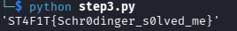


## Flag

```
ST4F1T{Schr0dinger_s0lved_me}
```

## Extra

- Might be over detailed leave a star and feel free to correct me if im wrong about something.


*Write-up by Ryn — ST4F1T CTF [2026]*